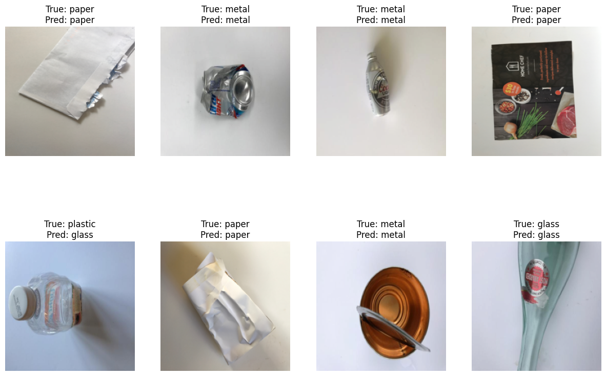
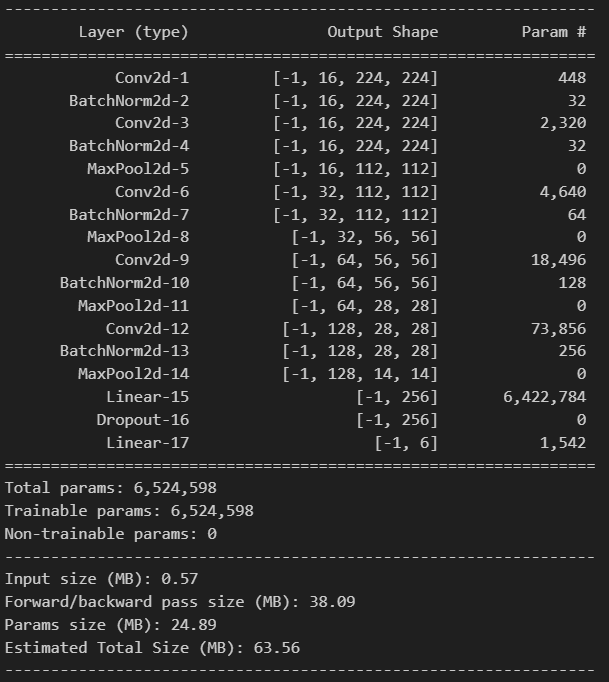

# Trash Classification

This project involves training a Convolutional Neural Network (CNN) model to classify various types of trash using the TrashNet dataset. The dataset is obtained from [Hugging Face](https://huggingface.co/datasets/garythung/trashnet).

<div align="center">
    
</div>

## 🛠️ Requirements

To run this project, you will need:

- Python
- Jupyter Notebook
- Huggingface for dataset
- WandB AI for experiment tracking
- PyTorch
- Scikit-learn
- Matplotlib
- Seaborn

## Setting Up
This project uses Huggingface and WandB. To run the project, you need to set up your Huggingface token and WandB API key.
### Huggingface
1. Create an account at https://huggingface.co/.
2. Get your token from Huggingface tokens page.
### WandB
1. Create a WandB account at https://wandb.ai/.
2. Get your API key by visiting https://wandb.ai/authorize.

## 🚀 How to Run

To run the model locally, you can follow these steps:

1. Clone this repository:
```bash
git clone https://github.com/randyver/trash-classification.git
cd trash-classification
```

2. Install dependencies:
```bash
pip install -r requirements.txt
```

3. Login Huggingface and input your token:
```bash
huggingface-cli login
```

4. Execute the Jupyter notebook:
```bash
jupyter notebook notebook/trash_classification.ipynb
```

5. When the program prompts for a wandb login, you will be required to input your wandb API key.

## Dataset

The dataset used in this project is the TrashNet dataset, available on Hugging Face at https://huggingface.co/datasets/garythung/trashnet. This dataset contains labeled images of trash categorized into six classes: Cardboard, Glass, Metal, Paper, Plastic, and Trash, which are used for training and testing the CNN model.

## Model Architecture
<div align="center">
    
</div>
The model used in this project is a Convolutional Neural Network (CNN) designed for image classification. First block was inspired by vgg architecture. 
Each block of layers contain convolutional layer, each used batchnorm2d for batch normalization, ReLU for activation, and a maxpool. This model consists of total 6.5M parameters. It consists of the following layers:

1. Convolutional Layers: each block of layers contain convolutional layer, each used batchnorm2d for batch normalization and ReLU for activation. 

2. Batch Normalization: Used BatchNorm2d with channel size for each layer to faster convergance and prevent internal covariate shift.

3. Activation Function: 
   After each convolutional operation, the ReLU (Rectified Linear Unit) activation function is applied to introduce non-linearity.

4. Max Pooling:
   After each convolutional layer, a 2x2 max pooling operation is applied to reduce the spatial dimensions of the feature maps, thereby reducing computational complexity and controlling overfitting.

5. Fully Connected Layers:
   After flattening the output from the last convolutional layer, the model passes it through two fully connected layers(fc1). The first fully connected layer has 256 neurons, and the second outputs the final class probabilities which is 6.
6. Dropout:
   After fc1 we use dropout with rate 0.2   
7. Output Layer:
   The output layer consists of 6 neurons corresponding to the 6 classes in the TrashNet dataset.
##  Huggingface Repository
This repository contains the trained model:

https://huggingface.co/IHateStats/Trash-Classification-6.5M

## 📈 WandB Model Tracking
This page contains experimental logs and graphs, including training and validation accuracy, as well as training and validation loss:

https://wandb.ai/emeryzwageri-institut-teknologi-bandung/Trash-Classification